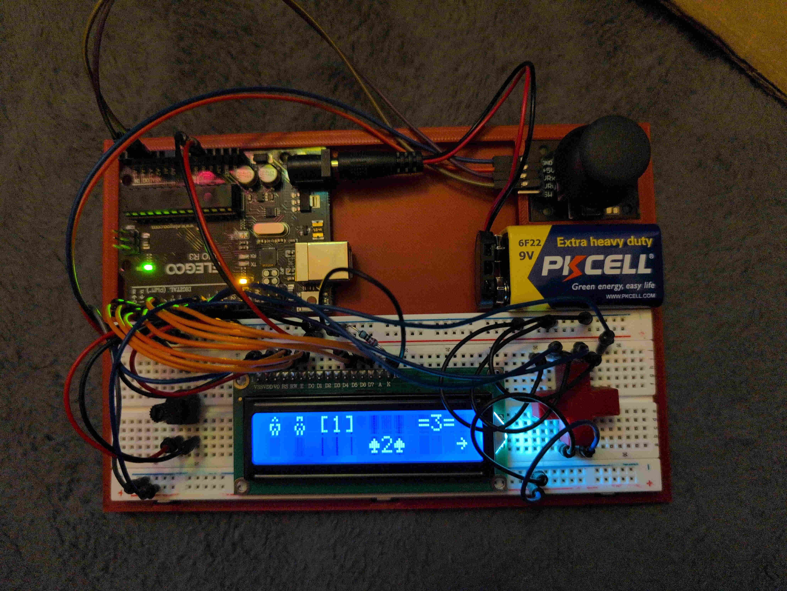

arduino_arcade
==============

This project's skeleton was generated with this `cargo-generate` template: <https://github.com/Rahix/avr-hal-template.git>. 

Rust project for the _Arduino Uno_.

## Summary
A rust project for the Arduino Uno and a 16x2 character LCD Display (1602A / HD44780).
It makes a tiled overworld in which you can easily add new games with 8 configurable sprites per game.

Currently 5 games 1(dodging blocks), 2(Black jack), 3(asteroid shooter), 4(sokoban, aka block pushing), and 5(enemy survival) are implemented.

The controls are either 4 buttons to make a dpad or a joystick (the joystick must be plugged in otherwise the floating analog inputs will give garbage inputs).

## Build Instructions
1. Install prerequisites as described in the [`avr-hal` README] (`avr-gcc`, `avr-libc`, `avrdude`, [`ravedude`]).

2. Run `cargo build` to build the firmware.

3. Run `cargo run` to flash the firmware to a connected board.  If `ravedude`
   fails to detect your board, check its documentation at
   <https://crates.io/crates/ravedude>.

4. `ravedude` will open a console session after flashing where you can interact
   with the UART console of your board.

[`avr-hal` README]: https://github.com/Rahix/avr-hal#readme
[`ravedude`]: https://crates.io/crates/ravedude

## License
Licensed under the GNU GPL 3.0
   ([LICENSE](LICENSE) or <https://www.gnu.org/licenses/gpl-3.0.en.html>)
